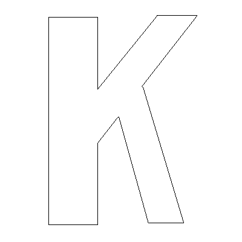
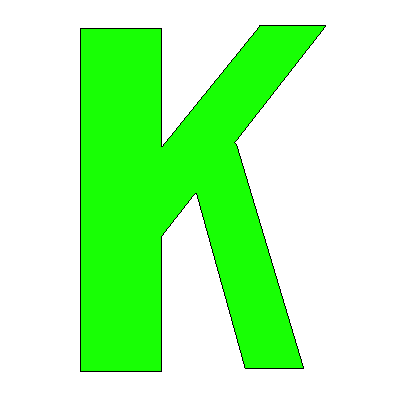
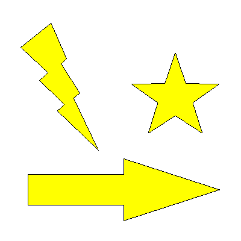

# Architektura komputerów - RISC-V projekt
## Autor: Krzysztof Wyrzykowski
Zadaniem było napisanie programu w asemblerze architektury RISC-V, który wypełnia zadanym kolorem wielokąty na obrazach w formacie bitmapy 24-bitowej.
# Instrukcja uruchomienia
Aby uruchomić program należy:
- uruchomić symulator RARS znajdujący się w pliku rars1_6.jar (wymagana jest instalacja Javy)
- poprzez zakładkę File -> Open otworzyć plik filling_polygon_Krzysztof_Wyrzykowski.asm
- nacisnąć przycisk 🛠 znajdujący się w środku górnego paska symulatora
- nacisnąć znajdujący się obok przycisk ▶
Program powinien się uruchomić. Aby wypełnić wielokąt kolorem należy:
- podać ścieżkę do pliku .bmp
- podać wielkimi literami kolor wypełnienia w formacie RGB inny niż czarny (000000)
# Przykład działania
Program wypełnia wielokąty o dowolnie skomplikowanym kształcie.

  
  

Jest w stanie również wypełnić więcej niż jeden wielokąt na jedynym obrazie.

  
  

Oraz poprawnie wypełnia figury niejednospójne.

  
  

